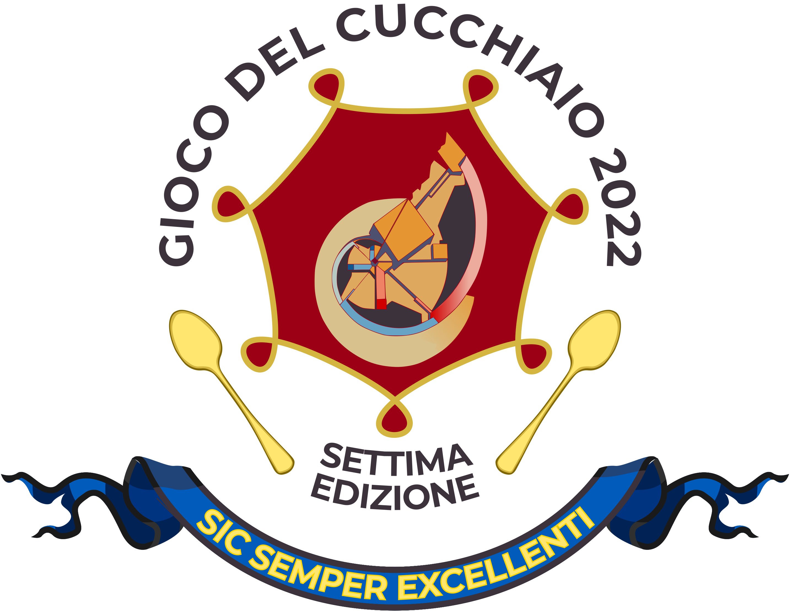

## Cos'è

Il "Gioco del Cucchiaio" è un sentito evento che ogni anno coinvolge gli studenti di un incognito collegio di Padova.

Sotto la guida di un anonimo personaggio, che si fa chiamare Mors Vobiscum, i combattenti si sfidano a colpi di cucchiai e altre armi improprie finché un solo giocatore sopravvive.

Vincere il Gioco porta gloria eterna e infiniti privilegi all'interno del collegio.

## Cosa contiene
Da alcuni anni il gioco è gestito tramite una applicazione web, che permette automaticamente l'assegnazione degli obiettivi e la registrazione degli obiettivi.

Questa repository contiene tutto il codice necessario a far funzionare tale applicazione, che si trova attiva [qui](https://gdcsgss.x10.mx/).

## Com'è fatto
L'elenco delle librerie utilizzate, nonché degli autori, è riportato [qui](https://gdcsgss.x10.mx/about).

## Segnalare un problema
Per segnalare un problema, utilizza per cortesia la scheda [issues](https://github.com/lzampieri/gdc_sgss/issues). Utilizza lo stesso sistema per segnalare qualsiasi possibile problema di sicurezza che noti.

## Contribuire
Ogni contributo è ben accetto. Per contribuire, contatta l'amministratore.

## Licenza
Tutto il codice è pubblicato in licenza aperta sotto le linee guida della [MIT license](https://opensource.org/licenses/MIT).
